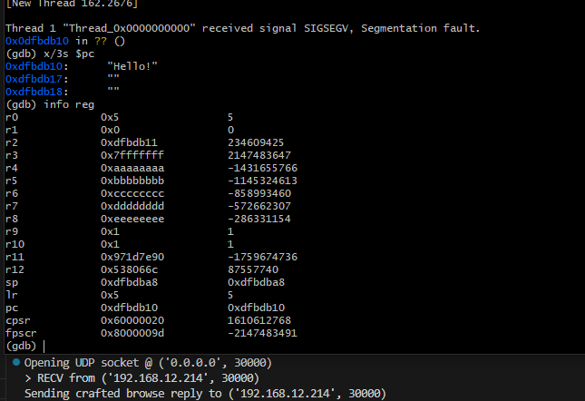
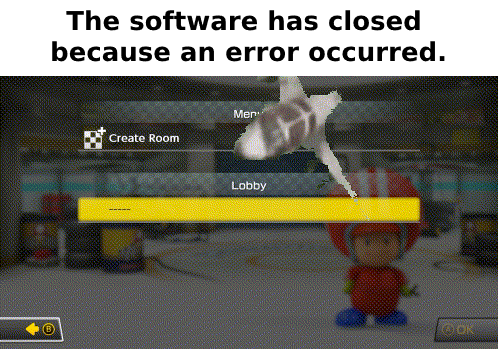

[latte]: https://latte.to
[discord]: https://latte.to/discord
[badges/latte]: https://img.shields.io/badge/https%3A%2F%2Flatte.to-2980b9?style=flat
[badges/discord]: https://img.shields.io/discord/892211155303538748?label=Latte%20Softworks%20Discord&logo=discord&logoColor=FFFFFF&color=5865F2

# Kart"LAN"Pwn ([CVE-2024-45200](https://nvd.nist.gov/vuln/detail/CVE-2024-45200))

[![Latte Softworks Website][badges/latte]][latte] [![Latte Softworks Discord][badges/discord]][discord]

Information & Proof-of-Concept for Mario Kart 8 Deluxe's "KartLANPwn" stack-based buffer overflow vulnerability<br>
Written by [@regginator](https://github.com/regginator)

<div align="center">

|    |    |
| :- | :- | 
| CVE            | **CVE-2024-45200** |
| CVSS 3.1       | **Undetermined** *<sub>(**[Nintendo](https://hackerone.com/reports/2611669)**.. claims it's a 4.3/10)</sub>* |
| Bounty Paid    | **$512** |
| H1 Report      | **[#2611669](https://hackerone.com/reports/2611669)** |
| Discovered     | **July 2nd, 2024** |
| Fixed          | **Sept. 11th, 2024** (**v3.0.3**) |
| Disclosed      | **Sept. 29th, 2024** |

</div>

### Contents

* [Background Information](#background-information)
* [Introduction](#introduction)
    * [LAN Protocol (Browse-Reply Packet)](#lan-protocol-browse-reply-packet)
    * ["`LAN_CopyAppData`" Pseudocode](#lan_copyappdata-pseudocode)
* [Proof-of-Concept](#proof-of-concept)
    * [Demonstration of PoC](#demonstration-of-poc)
* [Closing Thoughts](#closing-thoughts)
* [Credits](#credits)
* [Report Timeline](#report-timeline)
* [License](#license)

### Background Information

KartLANPwn is a vulnerability in Mario Kart 8 Deluxe's **incorrect usage** of the [`Pia`](https://github.com/kinnay/NintendoClients/wiki/Pia-Overview) P2P networking library, in which individual implementations of "[`CopyAppData`](#lan_copyappdata-pseudocode)" are sometimes called with an `outBufSize` larger than the `out` buffer itself. This can potentially lead to user-mode remote code execution (RCE) on peers' consoles if chained with an info leak. KartLANPwn affects the usage of `Pia`'s implementations of **LAN/LDN** multiplayer and **NEX** online multiplayer.

This vulnerability affects **all** versions of Mario Kart 8 Deluxe up to and including **v3.0.1** *(v3.0.2 for China/Tencent)*, and has specifically been [demonstrated](#demonstration-of-poc) via the "LAN Play" feature on the v3.0.1 retail release of MK8DX.

As of **2024/09/11**, Nintendo has deployed a fix for KartLANPwn alongside **v3.0.3** for all regions, excluding China. As of **2024/09/27**, v3.0.3 has now also been released for China. We have safely disclosed this information after receiving permission from Nintendo.

## Introduction

The proprietary `Pia` networking library is used by first-party Nintendo Switch games with local or online-play support to provide peer-to-peer netcode implementations for LAN/LDN (local multiplayer) and the `NEX` protocol, used for online multiplayer.

For demonstration's sake, we will specifically be focused on `Pia`'s LAN protocol. The room host's console opens a UDP "discovery" socket at `:30000` on a local broadcast address (`255.255.255.255`) and other consoles on the same network are supposed to advertise "browse requests" from their own socket (also on `:30000`) to the router to forward to other devices on the same network.

The room host (our 'server') sends back an initial "browse reply" that's supposed to contain information about the room (the host's display name, Mii data, # of players, etc). Within the browse-reply packet, the length of the application data to be copied into the `out` buffer can be controlled with a value of up to 150, even though `out` is only 128 bytes wide. This allows for overflowing values on the stack frame (in this specific case, for a `pop {r4-r8, pc}`)

### LAN Protocol (Browse-Reply Packet)

*At least in the case of the `Pia` version MK8DX is using*, for what we're focusing on, browse-reply packets for LAN are constructed as follows:

(All int types are encoded as big-endian)

| Index | Pseudo-Type     | Description |
| :---: | :-------------- | ----------- |
| 0     | `u8`            | Packet type (`0x1`) |
| 1     | `u32`           | Size of session info body (`1266` in our case) |
| 5     | (`42` bytes)    | Misc session info fields, irrelevant to us |
| 47    | (`0x180` bytes) | **Start of space for application data** |
| 431   | `u32`           | **Length of application data** |

*The rest of session info follows, though unimportant for crafting a packet for KartLANPwn*

#### "`LAN_CopyAppData`" Pseudocode

For the sake of demonstration, below is rough pseudocode from the LAN implementation of "`CopyAppData`". While nothing is inherently wrong with this function alone, incorrect usage (in MK8DX's case) can allow for the stack frame to be overwritten by our input application data in `packet`.

(function located @ `+0xA0F8C0` in `main` for MK8DX v3.0.1)
```c
void LAN_CopyAppData(int* r0, int packet, int out, uint outBufSize) {
    int u1 = 68612;

    if (out != NULL) {
        // The actual length to read from the `packet` buffer at the start of our
        // application data (which our 'server' controls)
        uint appDataLength = *(uint *)(packet + 432);

        // In some cases, outBufSize is input as a larger number than the bounds of the
        // `out` buffer, which allows a stack buffer overflow (in our specific case, `*out`
        // is 128 bytes long, and outBufSize is 150!)
        if (appDataLength <= outBufSize) {
            memcpy(out, packet + 48, outBufSize); // packet[47], start of application data

            u1 = 0;
        }

        *r0 = u1;
        return;
    }

    *r0 = 68615;
    return;
}
```

## Proof-of-Concept

*See [kartlanpwn-poc.py](kartlanpwn-poc.py)*

We've provided a simple PoC script written in Python, which acts as a fake room host that replies to peers' consoles with a specially crafted "browse-reply" packet that will crash the game's process when you open the "LAN Play" menu in MK8DX from a console on the same network as the computer running the script.

#### Requirements

* A recent version of [Python 3](https://www.python.org/downloads/)

Either [download the repo's zip from GitHub directly](https://github.com/latte-soft/kartlanpwn/archive/refs/heads/master.zip), or clone using `git`:

```
git clone https://github.com/latte-soft/kartlanpwn.git && cd kartlanpwn
python3 kartlanpwn-poc.py
```

### Demonstration of PoC

See video demonstration (YouTube):

> [](https://www.youtube.com/watch?v=ENAkBqMqFYs)

And for you ARM nerds, here's a screenshot from GDB of the resulting process segfault:



## Closing Thoughts

It only took a couple of days to figure out the details of the bug itself, but actually making use of the overflow? That's a whole other can of worms. The Nintendo Switch kernel's usermode doesn't play around; it's extremely strict in every crevice it can be. We spent many hours exchanging and tampering with different ideas and leads, to no ultimate avail for real (arbitrary) code execution. In our specific case, even reliable ROP didn't appear very doable, being that pretty much *all* relative networking-related functions were class-based, plus we also only had direct write access to `r4-r8`. (`*_this` my beloved) Plus, w/out a previous information leak, it isn't too doable to just skip a `mov r4, r0` or what-have-you to control the `_this` pointer. Fun stuff!

Report-wise, everything was actually a relatively smooth process this time with Nintendo triage from time of report, to disclosure. While the bounty payout of **$512** was far less than I anticipated (aren't they all?), anything beats the "Nintendo Ninjas" showing up at my door..

Nintendo most definitely learned their lesson per se from the simpler days of the Wii, 3DS, and even Wii U. They did their homework; successful exploitation of any kind beyond denial-of-service crashing **from usermode** on the Switch is nearly impossible. ASLR, forced No-eXecute pages (you cannot directly write to executable memory pages, games need to use a [dedicated sysmodule](https://switchbrew.org/wiki/JIT_services) just for JIT!), inability to ROP, among other pain points. <sub>*(waiting for the modding scene to eat these words in no time..)*</sub> On the other hand, in the last couple of months, I have learned a ton about a completely new platform and architecure (to me anyway) in a very short amount of time, not to mention the awesome people I've had the pleasure of working with on KartLANPwn! (Thanks Pablo and fishguy 😄)

## Credits

* Discoverer: [reggie](https://github.com/regginator)
* Great help & a huge thanks: [PabloMK7](https://github.com/PabloMK7), [fishguy6564](https://github.com/fishguy6564)
* Emotional support 🙃: [Justus](https://github.com/0xJustus), [Sky](https://github.com/cfwsky)

## Report Timeline

| Date           | Info |
| :------------- | :--- |
| **2024/07/18** | Report submitted to Nintendo via HackerOne |
| **2024/07/31** | Report triaged internally |
| **2024/09/11** | Fix released alongside Mario Kart 8 Deluxe **v3.0.3** for all regions, excluding China |
| **2024/09/12** | Bounty paid out by Nintendo |
| **2024/09/12** | Other researchers [quite quickly found out](https://x.com/OatmealDome/status/1834350565544824979) about the fix for "`a security flaw in the game's netcode`" in the bindiff for v3.0.3 |
| **2024/09/27** | Mario Kart 8 Deluxe v3.0.3 released for the Chinese region |
| **2024/09/29** | Nintendo granted disclosure, this repository made public |
| **2024/09/30** | CVE-2024-45200 [published](https://nvd.nist.gov/vuln/detail/CVE-2024-45200) by the NVD |

## License

[](https://creativecommons.org/licenses/by/4.0/)

[KartLANPwn](https://github.com/latte-soft/kartlanpwn) © 2024 by reggie (<reggie@latte.to>), Latte Softworks (<https://latte.to>) is licensed under CC BY 4.0.<br>
To view a copy of this license, visit <https://creativecommons.org/licenses/by/4.0/>

___

<div align="center">

*<sub>This gif was created on July 3rd, 2024:</sub>*



</div>
